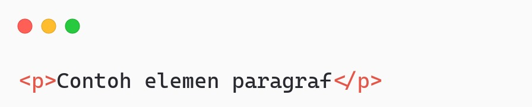
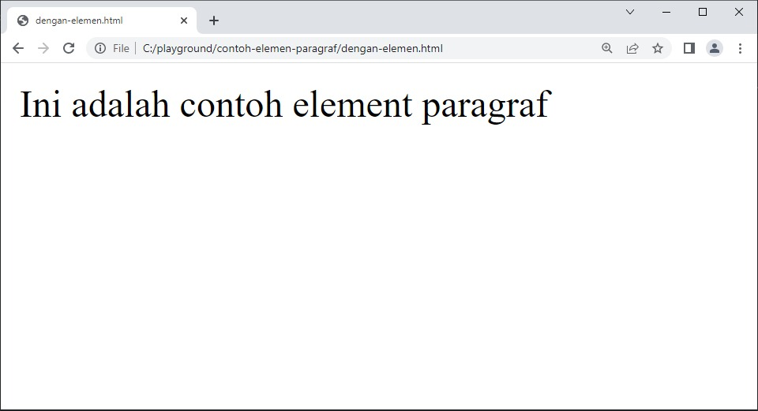
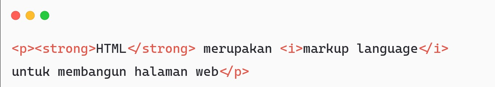

Elemen adalah salah satu bagian dari HTML dalam membangun halaman web. Ini digunakan untuk mendefinisikan konten-konten yang ditampilkan dalam halaman web. Contohnya, kita bisa menggunakan elemen paragraf dalam menampilkan media teks sebagai kontennya.

Gambar di atas adalah salah satu contoh elemen untuk menampilkan paragraf dalam halaman web. Bagaimana dengan judul? Tentunya, HTML memiliki elemen khusus untuk hal tersebut. HTML memiliki segudang elemen untuk mendukung kita dalam membuat halaman web yang baik.

Jika gambar di atas dijalankan, hasilnya seperti berikut.

# Elemen dalam Elemen
Selain memiliki teks sebagai konten, elemen dapat memiliki elemen lain di dalamnya atau biasa disebut dengan child-element. Contohnya, kami memiliki elemen paragraf dengan teks sebagai konten di dalamnya. Kami ingin memberikan format teks miring atau tebal pada beberapa kata. Berikut adalah hasil implementasinya.

#

