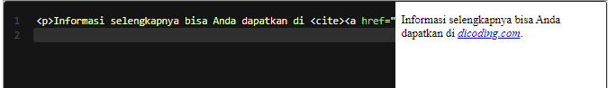

# Inline Formatting Text: Citation, Defining Terms, Subscript, Superscript, Highlighted Text, dan Line Break
Kita sudah belajar banyak formatting text. Namun, ada beberapa sisanya yang belum kita bahas. Tentunya, mereka tidak kalah penting dalam membangun konten halaman web yang lebih baik. Mari kita lengkapi pembahasan ini. Jom!

# Citation
Selain sebuah atribut, <cite> juga merupakan sebuah elemen yang digunakan untuk sebuah rujukan pada sebuah dokumen, contohnya sebuah buku, majalah, artikel, dan lainnya.

Standarnya, pada browser sebuah teks yang diberi markup <cite> akan ditampilkan dengan huruf miring (italic).

