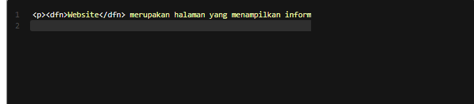

# Defining Terms
Elemen <dfn> digunakan ketika mendefinisikan sebuah istilah (term). Elemen ini harus terletak pada elemen lain yang menaunginya. Contohnya pada sebuah elemen 
 atau elemen <section>. Berikut contoh penggunaannya.

Standar pada browser yakni sebuah teks yang diberi markup <dfn> akan ditampilkan dengan huruf miring (italic).