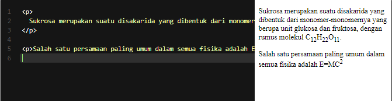

# Subscript dan Superscript
Subscript  dan superscript  adalah elemen yang dapat membuat teks yang ditampilkan tampak kecil, dengan posisi di bawah (sub) atau di atas (sup) dari teks biasanya. Elemen ini digunakan untuk menunjukkan sebuah rumus kimia ataupun matematika.

