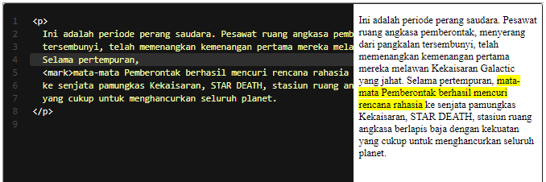

# Highlighted Text
Untuk menandai atau menyorot sebuah teks kita bisa menggunakan elemen <mark>. Elemen ini digunakan ketika terdapat sebuah teks yang memiliki peran penting, biasanya teks tersebut merupakan bagian yang paling relevan atau penting dalam sebuah konteks kalimat.

Standarnya, pada browser teks yang diberi markup <mark> akan ditampilkan dengan background kuning dan teks hitam.

