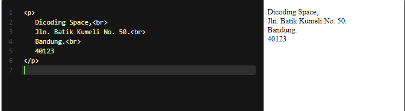

# Line Break
Terkadang, kita mungkin perlu menambahkan sebuah baris baru pada sebuah baris teks (termasuk dalam paragraf), tetapi kita mengetahui bahwa browser akan mengabaikan sebuah penulisan spasi ganda ataupun garis baru. Jadi, kita memerlukan sebuah tanda yang dapat digunakan untuk memberitahu browser untuk “Tambahkan baris baru di sini!”.

Inline line break element ( ) dapat digunakan untuk memberitahu browser untuk memberikan sebuah garis baru pada baris teks. Sama seperti gambar, elemen ini merupakan elemen kosong sehingga kita tidak membutuhkan sebuah tag penutup.

