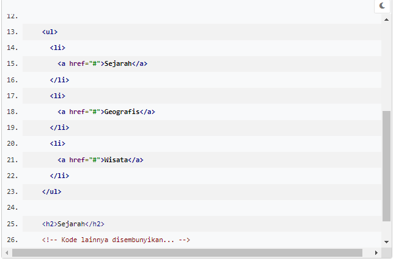
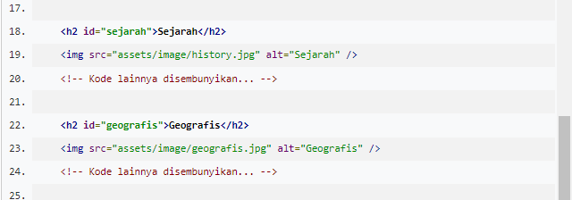
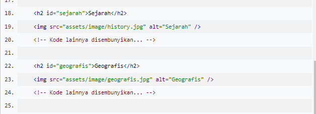

# Latihan: Menerapkan Elemen Anchor pada Halaman Profil
Anda sudah belajar banyak sekali elemen-elemen pemberi format teks yang melengkapi pengembangan halaman web. Nah, sekarang waktunya kita berlatih agar materi yang dipelajari dapat terimplementasikan secara langsung.

# Tujuan
Pada latihan sebelumnya, kita telah membuat daftar navigasi untuk setiap topik pembicaraan artikel. Nah, pada mulanya, kita berekspektasi daftar navigasi tersebut dapat mengarahkannya ke topik spesifik sesuai topik yang dipilih/tekan. Namun, hal tersebut belum dapat terealisasikan.

Kita akan memanfaatkan elemen anchor dan menambahkan sedikit atribut yang akan berperan dalam masalah di atas. Hasilnya, Halaman Profil sudah dapat dijelajahi dengan daftar navigasi. Sangat menarik, kan?

* Untuk menerapkan elemen anchor, tentu saja kita perlu memperbarui kode pada dokumen HTML. Jadi, silakan buka kembali berkas index.html dan tambahkan atau sesuaikan kodenya agar sesuai dengan kode bercetak tebal berikut.

* Setelah menambahkan elemen anchor pada list item, tampilan navigation list akan menjadi hyperlink
* Namun, ketika salah satu item ditekan, tidak ada apa pun yang terjadi. Hal ini karena atribut href belum mengetahui topik yang akan diincar. Nilai href dapat berupa URL untuk mengarahkan ke halaman yang berbeda atau berupa anchor (tanda pagar (#)) yang diikuti dengan nama id dari elemen. Hal ini berguna untuk mengarahkan fokus pengguna pada elemen tersebut.

Oleh karena itu, mari kita berikan atribut id pada elemen-elemen yang akan menjadi target navigasi. Silakan sesuaikan kodenya dengan kode yang memiliki cetakan tebal berikut.

* Apakah Anda ingin mencoba melihat hasilnya? Silakan! Namun, tidak ada perubahan yang tampak pada browser karena kita hanya menambahkan identitas pada elemen <h2> saja.

* Mari kita lanjutkan! Dari masing-masing elemen <h2> yang telah ditambahkan id, berikan juga pada setiap elemen anchor pada navigation list.

* Sip! Seharusnya, navigasi sudah berfungsi dengan baik

