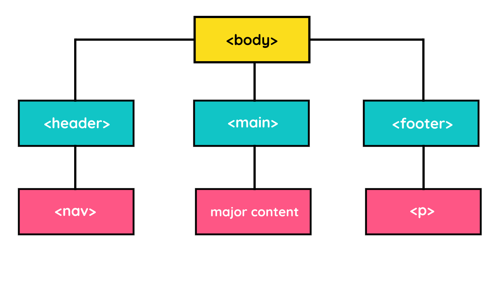

Latihan: Menetapkan Elemen Header, Main, dan Footer di Halaman Profil
Syukurlah! Semakin kaya akan ilmu dari materi ke materi setelah dipelajari sebelumnya. Seperti biasa, kita akan kembali praktik kali ini. Sudah siap? 

Tujuan
Pada latihan ini, kita akan melakukan pengelompokan elemen berdasarkan kontennya. Ada konten yang bersifat sebagai kepala (header), pokok (main), dan kaki (footer). Halaman Profil yang telah kita miliki sebelumnya dapat dikelompokkan menjadi tiga bagian tersebut.

Nah, harapannya, browser akan semakin memahami hal yang sebenarnya ia tampilkan. Ini karena kita memanfaatkan tiga buah elemen, yaitu <header>, <main>, dan <footer>. Bagaimana dengan hasilnya? Mari kita lihat pada latihan ini.

# Alur Latihan
Berikut adalah alur latihan kali ini.

1. Membuka hasil latihan terakhir dengan VSCode.
2. Membungkus judul halaman beserta deskripsinya dan daftar navigasi dengan elemen header.
3. Membungkus teks hak cipta dengan elemen footer.
4. Membungkus konten utama dengan elemen main.
5. Menjalankan dokumen HTML pada browser.

Latihan Menetapkan Elemen Header, Main, dan Footer di Halaman Profil

* Kita akan membagi konten yang ditampilkan pada halaman web. Tentu saja konten tersebut berada dalam elemen <body>. Pembagian ini terbagi menjadi tiga bagian besar, yaitu heading (), main, dan footer.
baris

* Sebelumnya, kita telah membuat daftar navigasi menggunakan elemen list. Namun, browser tidak mengetahui bahwa elemen list tersebut merupakan navigation list karena ia hanyalah elemen yang menampilkan sebuah daftar barang saja. Oleh karena itu, kita akan memanfaatkan semantic element lainnya yang bernama <nav>. Silakan bungkus elemen list dengan elemen nav menjadi seperti berikut. (baris 16)

* Sudah selesai mengelompokkan konten kepala dengan elemen header. Kita akan masuk ke bagian konten kaki terlebih dahulu. Pada konten hak cipta (copyright)–biasanya berada di paling akhir dari konten body, pindahkan atau bungkus konten tersebut dalam elemen <footer>. Hasilnya seperti berikut. (baris 24)

* Dua konten sudah kita kelompokkan. Terakhir adalah konten pokok atau utama. Elemen apa yang akan kita gunakan untuk mengelompokkan konten tersebut? Tentu saja jawabannya adalah elemen <main>. Silakan bungkus seluruh isi elemen di antara elemen <header> dan <footer> dengan elemen <main>. Hasilnya seperti berikut. (baris 30)

kode nya disini [Title](latihan2.html)

Alhasil, struktur body pada HTML menjadi seperti berikut.

# Bedah Kode
Keren! Halaman Profil kita semakin bagus dan terstruktur. Kita berhasil menerapkan elemen <header>, <main>, dan <footer>. Browser pun semakin senang karena ia paham hal yang ditampilkan ke user. Mari kita ulas apa yang telah dilakukan pada latihan ini.

* Konten Kepala
Halaman Profil memiliki beberapa konten yang muncul pertama kali atau paling atas. Konten tersebut adalah judul dan navigation list. Nah, elemen-elemen ini kita bungkus dengan elemen <header>. Elemen ini dapat mengandung berbagai elemen, seperti logo halaman, judul halaman, daftar navigasi, dan sebagainya yang bukan merupakan konten utama. Dalam konteks latihan ini, kita membungkus judul halaman beserta deskripsinya dan elemen navigation list.

* Konten Pokok
Konten pokok merupakan konten utama yang akan dikonsumsi oleh user. Dalam hal ini adalah teks bacaan atau artikel. Pada Halaman Profil, konten utama yang dimaksud adalah teks-teks yang membahas mengenai sejarah, geografis, dan wisata. Oleh karena itu, kita membungkusnya dengan elemen main.

* Elemen main dalam satu halaman tidak boleh ganda. Hal ini berarti elemen main hanya diperbolehkan berjumlah satu dalam tiap halaman web.

* Konten Kaki
Banyak informasi tambahan yang dapat disampaikan pada elemen kaki dan bisa kita bungkus dengan elemen footer. Tidak sedikit halaman web yang memanfaatkan elemen ini. Umumnya, elemen footer berisi informasi hak cipta, alamat, logo situs, formulir untuk langganan ke newsletter, dan sebagainya.

* Apakah Anda sudah coba periksa hasilnya di browser? Jika sudah, apakah Anda melihat ada perubahan yang terjadi dari latihan sebelumnya? Jika menjawab “tidak ada”, jawaban Anda benar! Hal ini karena kita hanya menstrukturkan ulang dokumen HTML. Tidak ada perubahan konten apa pun. Bahkan, tidak ada perubahan styling sedikit pun yang terjadi. Hal ini karena memang kita belum mempelajari materi styling. 

* Itulah beberapa hal yang kita lakukan pada latihan ini. Bagi sebagian dari kita merasa bahwa tidak banyak perubahan yang dilakukan. Hal tersebut tidak sepenuhnya salah karena tampilan halaman webnya pun tidak berbeda dengan sebelumnya. Namun, percayalah bahwa Halaman Profil kita semakin baik dan dimengerti oleh browser (semantic HTML).

* Tidak hanya sampai di sini. Ada satu perjalanan lagi yang akan kita lalui untuk meningkatkan kualitas dokumen HTML kita. Yuk, segera masuk ke materi berikutnya!