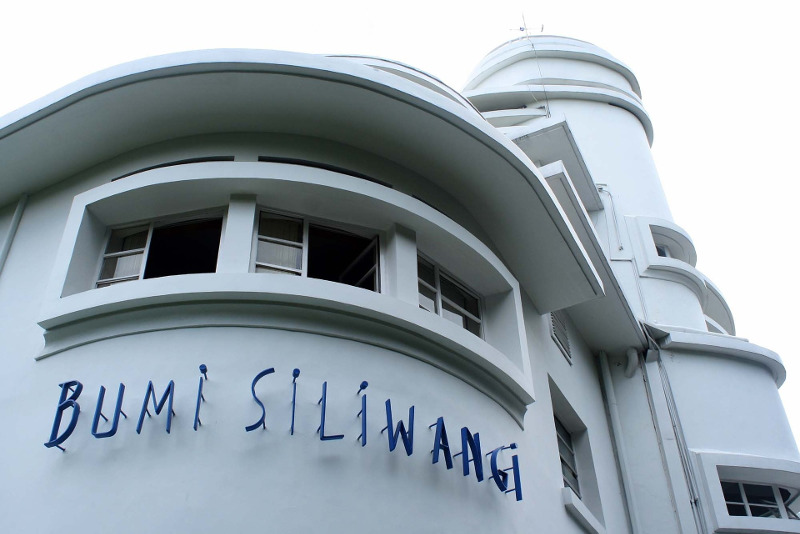

#Latihan: Menerapkan Elemen Div, Aside, Article, dan Section di Halaman Profil

ebelumnya, kita telah belajar dan menerapkan elemen-elemen semantik besar. Tidak hanya sampai di sana, kita akan terus menerapkan elemen semantic lainnya. Mari mulai berlatih.

# Tujuan
Konten-konten besar pada Halaman Profil telah dikelompokkan dengan tiga buah semantic element, yaitu header, main, dan footer. Nah, pada latihan ini, kita akan menerapkan beberapa semantic element lainnya sehingga dokumen HTML kita semakin baik.

Kita akan melakukan pengelompokan pada konten utama, yaitu konten-konten dalam elemen <main>. Sebagaimana judul latihan yang telah Anda lihat dan baca, kita akan menerapkan elemen aside, article, dan section dalam pengelompokannya. Selain itu, kita juga akan menggunakan elemen 
 untuk bagian yang khusus dan disediakan oleh HTML. Namun, jangan khawatir. Kita akan memberinya nama atau identitas dengan elemen id.

# Alur Latihan
Berikut adalah alur latihan kali ini.

1. Membuka hasil latihan terakhir dengan VSCode.
2. Membagi konten utama dengan elemen <article>.
3. Membungkus konten wisata menjadi beberapa bagian.
4. Menjalankan dokumen HTML pada browser.

# Latihan Menerapkan Elemen Div, Aside, Article, dan Section di Halaman Profil

Ikuti beberapa langkah berikut dengan saksama untuk berlatih di latihan ini.

1. Silakan buka proyek Halaman Profil terakhir dengan VSCode.
2. Pengelompokan akan dimulai dari hierarki teratas. Dalam elemen <main>, kita akan bagi konten menjadi dua bagian, yaitu konten artikel yang dikelompokkan menggunakan 
 dan konten samping yang dikelompokkan menggunakan <aside>. Silakan sesuaikan kodenya menjadi kode bercetak tebal berikut.

* Dengan begitu, konten elemen <main> terbagi menjadi dua, yaitu elemen 
 dan <aside>. Selanjutnya, kita mulai kelompokkan konten lebih detail lagi pada elemen 
. Jadi, silakan fokus saja pada elemen tersebut untuk langkah selanjutnya. 

   <main>
    <!-- Konten artikel -->
    

        

            <h2 id="Sejarah">Sejarah</h2>
            
            

                Kata Bandung berasal dari kata bendung atau bendungan karena terbendungnya sungai Citarum oleh
                lava Gunung Tangkuban Parahu yang lalu membentuk telaga. Legenda yang diceritakan oleh
                orang-orang tua di Bandung mengatakan bahwa nama Bandung diambil dari sebuah kendaraan air
                yang terdiri dari dua perahu yang diikat berdampingan yang disebut perahu bandung yang
                digunakan oleh Bupati Bandung, R.A. Wiranatakusumah II, untuk melayari Ci Tarum dalam mencari
                tempat kedudukan kabupaten yang baru untuk menggantikan ibu kota yang lama di Dayeuhkolot.
              

              

                Berdasarkan filosofi Sunda, kata Bandung juga berasal dari kalimat Nga-Bandung-an Banda
                Indung, yang merupakan kalimat sakral dan luhur karena mengandung nilai ajaran Sunda.
                Nga-Bandung-an artinya menyaksikan atau bersaksi. Banda adalah segala sesuatu yang berada di
                alam hidup yaitu di bumi dan atmosfer, baik makhluk hidup maupun benda mati. Sinonim dari
                banda adalah harta. Indung berarti Ibu atau Bumi, disebut juga sebagai Ibu Pertiwi tempat
                Banda berada.
              

              <h2 id="geografis">geografis</h2>
              
              

                Kota Bandung dikelilingi oleh pegunungan, sehingga bentuk morfologi wilayahnya bagaikan sebuah
                mangkok raksasa,[9] secara geografis kota ini terletak di tengah-tengah provinsi Jawa Barat,
                serta berada pada ketinggian ±768 m di atas permukaan laut, dengan titik tertinggi di berada
                di sebelah utara dengan ketinggian 1.050 meter di atas permukaan laut dan sebelah selatan
                merupakan kawasan rendah dengan ketinggian 675 meter di atas permukaan laut.
              

              

                Kota Bandung dialiri dua sungai utama, yaitu Sungai Cikapundung dan Sungai Citarum beserta
                anak-anak sungainya yang pada umumnya mengalir ke arah selatan dan bertemu di Sungai Citarum.
                Dengan kondisi yang demikian, Bandung selatan sangat rentan terhadap masalah banjir terutama
                pada musim hujan.
              

              <h2 id="Wisata">Wisata</h2>
              

                Sejak dibukanya Jalan Tol Cipularang, kota Bandung telah menjadi tujuan utama dalam menikmati
                liburan akhir pekan terutama dari masyarakat yang berasal dari Jakarta sekitarnya. Selain
                menjadi kota wisata belanja, kota Bandung juga dikenal dengan sejumlah besar bangunan lama
                berarsitektur peninggalan Belanda.
              

              <h3>Farm-house</h3>
              
              

                Berada di jalur utama Bandung-Lembang, Farm House menjadi objek wisata yang tidak pernah sepi
                pengunjung. Selain karena letaknya strategis, kawasan ini juga menghadirkan nuansa wisata khas
                Eropa. Semua itu diterapkan dalam bentuk spot swafoto Instagramable.
              

              <h3>Observatorium Bosscha</h3>
              
              

                Memiliki beberapa teleskop, antara lain, Refraktor Ganda Zeiss, Schmidt Bimasakti, Refraktor
                Bamberg, Cassegrain GOTO, dan Teleskop Surya. Refraktor Ganda Zeiss adalah jenis teleskop
                terbesar untuk meneropong bintang. Benda ini diletakkan pada atap kubah sehingga saat teropong
                digunakan, atap tersebut harus dibuka. Observatorium Bosscha boleh dikunjungi oleh siapapun,
                tanpa tiket. Namun, bagi yang ingin menggunakan teleskop Zeiss, wajib mendaftarkan diri. Untuk
                instansi atau lembaga pendidikan, diberikan jadwal hari Selasa sampai Jumat. Sementara itu,
                kunjungan individu dibuka setiap hari Sabtu.
              

        

        <!-- Konten samping -->

        <aside>
            <h2>Kota Bandung</h2>
            
Kota Kembang Paris van Java

            <figure>
                
                <figcaption>Lambang</figcaption>
            </figure>
        </aside>
    </main>

3. Dalam elemen ini (
), ada konten yang dapat digolongkan sebagai artikel. Artikel pertama memuat konten mengenai sejarah, berikutnya mengenai geografi, dan terakhir mengenai wisata. Dengan hasil identifikasi tersebut, kita memerlukan tiga buah elemen <article> untuk membungkus masing-masing konten tersebut. Masing-masing elemen <article> akan terdiri dari heading, gambar, dan paragraf.

Silakan sesuaikan kodenya menjadi seperti berikut pada bagian elemen 
.

<!-- Konten artikel -->

    

        <article>
            <h2 id="Sejarah">Sejarah</h2>
            
            

                Kata Bandung berasal dari kata bendung atau bendungan karena terbendungnya sungai Citarum oleh
                lava Gunung Tangkuban Parahu yang lalu membentuk telaga. Legenda yang diceritakan oleh
                orang-orang tua di Bandung mengatakan bahwa nama Bandung diambil dari sebuah kendaraan air
                yang terdiri dari dua perahu yang diikat berdampingan yang disebut perahu bandung yang
                digunakan oleh Bupati Bandung, R.A. Wiranatakusumah II, untuk melayari Ci Tarum dalam mencari
                tempat kedudukan kabupaten yang baru untuk menggantikan ibu kota yang lama di Dayeuhkolot.
              

           
              

                Berdasarkan filosofi Sunda, kata Bandung juga berasal dari kalimat Nga-Bandung-an Banda
                Indung, yang merupakan kalimat sakral dan luhur karena mengandung nilai ajaran Sunda.
                Nga-Bandung-an artinya menyaksikan atau bersaksi. Banda adalah segala sesuatu yang berada di
                alam hidup yaitu di bumi dan atmosfer, baik makhluk hidup maupun benda mati. Sinonim dari
                banda adalah harta. Indung berarti Ibu atau Bumi, disebut juga sebagai Ibu Pertiwi tempat
                Banda berada.
              

        </article>

        <article>
            <h2 id="Geografis">Geografis</h2>
            
            

                Kota Bandung dikelilingi oleh pegunungan, sehingga bentuk morfologi wilayahnya bagaikan sebuah
                mangkok raksasa,[9] secara geografis kota ini terletak di tengah-tengah provinsi Jawa Barat,
                serta berada pada ketinggian ±768 m di atas permukaan laut, dengan titik tertinggi di berada
                di sebelah utara dengan ketinggian 1.050 meter di atas permukaan laut dan sebelah selatan
                merupakan kawasan rendah dengan ketinggian 675 meter di atas permukaan laut.
              

           
              

                Kota Bandung dialiri dua sungai utama, yaitu Sungai Cikapundung dan Sungai Citarum beserta
                anak-anak sungainya yang pada umumnya mengalir ke arah selatan dan bertemu di Sungai Citarum.
                Dengan kondisi yang demikian, Bandung selatan sangat rentan terhadap masalah banjir terutama
                pada musim hujan.
              

        </article>

        <article>
            <h2>Wisata</h2>
            

                Sejak dibukanya Jalan Tol Cipularang, kota Bandung telah menjadi tujuan utama dalam menikmati
                liburan akhir pekan terutama dari masyarakat yang berasal dari Jakarta sekitarnya. Selain
                menjadi kota wisata belanja, kota Bandung juga dikenal dengan sejumlah besar bangunan lama
                berarsitektur peninggalan Belanda.
            

            <h3>Farm-house Lembang</h3>
            
            

                Berada di jalur utama Bandung-Lembang, Farm House menjadi objek wisata yang tidak pernah sepi
                pengunjung. Selain karena letaknya strategis, kawasan ini juga menghadirkan nuansa wisata khas
                Eropa. Semua itu diterapkan dalam bentuk spot swafoto Instagramable.
            

            <h3>Observatorium Bosscha</h3>
            
            

                Memiliki beberapa teleskop, antara lain, Refraktor Ganda Zeiss, Schmidt Bimasakti, Refraktor
                Bamberg, Cassegrain GOTO, dan Teleskop Surya. Refraktor Ganda Zeiss adalah jenis teleskop
                terbesar untuk meneropong bintang. Benda ini diletakkan pada atap kubah sehingga saat teropong
                digunakan, atap tersebut harus dibuka. Observatorium Bosscha boleh dikunjungi oleh siapapun,
                tanpa tiket. Namun, bagi yang ingin menggunakan teleskop Zeiss, wajib mendaftarkan diri. Untuk
                instansi atau lembaga pendidikan, diberikan jadwal hari Selasa sampai Jumat. Sementara itu,
                kunjungan individu dibuka setiap hari Sabtu.
              

              
        </article>
    

4. Penambahan elemen terakhir untuk elemen 
. Kita akan mengelompokkan konten lagi dengan elemen <section>. Perhatikan pada elemen <article> terakhir (topik wisata), konten tersebut memiliki dua subjudul, yaitu wisata Farm House dan Observatorium Bosscha. Oleh karena itu, kita dapat mengelompokkan juga pada kedua konten ini dengan menggunakan elemen <section>.

Jadi, seluruh konten yang berada pada elemen 
 memiliki struktur seperti berikut.

<!-- Konten artikel -->
    

        <article>
            <h2 id="Sejarah">Sejarah</h2>
            
            

                Kata Bandung berasal dari kata bendung atau bendungan karena terbendungnya sungai Citarum oleh
                lava Gunung Tangkuban Parahu yang lalu membentuk telaga. Legenda yang diceritakan oleh
                orang-orang tua di Bandung mengatakan bahwa nama Bandung diambil dari sebuah kendaraan air
                yang terdiri dari dua perahu yang diikat berdampingan yang disebut perahu bandung yang
                digunakan oleh Bupati Bandung, R.A. Wiranatakusumah II, untuk melayari Ci Tarum dalam mencari
                tempat kedudukan kabupaten yang baru untuk menggantikan ibu kota yang lama di Dayeuhkolot.
              

           
              

                Berdasarkan filosofi Sunda, kata Bandung juga berasal dari kalimat Nga-Bandung-an Banda
                Indung, yang merupakan kalimat sakral dan luhur karena mengandung nilai ajaran Sunda.
                Nga-Bandung-an artinya menyaksikan atau bersaksi. Banda adalah segala sesuatu yang berada di
                alam hidup yaitu di bumi dan atmosfer, baik makhluk hidup maupun benda mati. Sinonim dari
                banda adalah harta. Indung berarti Ibu atau Bumi, disebut juga sebagai Ibu Pertiwi tempat
                Banda berada.
              

        </article>

        <article>
            <h2 id="Geografis">Geografis</h2>
            
            

                Kota Bandung dikelilingi oleh pegunungan, sehingga bentuk morfologi wilayahnya bagaikan sebuah
                mangkok raksasa,[9] secara geografis kota ini terletak di tengah-tengah provinsi Jawa Barat,
                serta berada pada ketinggian ±768 m di atas permukaan laut, dengan titik tertinggi di berada
                di sebelah utara dengan ketinggian 1.050 meter di atas permukaan laut dan sebelah selatan
                merupakan kawasan rendah dengan ketinggian 675 meter di atas permukaan laut.
              

           
              

                Kota Bandung dialiri dua sungai utama, yaitu Sungai Cikapundung dan Sungai Citarum beserta
                anak-anak sungainya yang pada umumnya mengalir ke arah selatan dan bertemu di Sungai Citarum.
                Dengan kondisi yang demikian, Bandung selatan sangat rentan terhadap masalah banjir terutama
                pada musim hujan.
              

        </article>

        <article>
            <h2>Wisata</h2>
            

                Sejak dibukanya Jalan Tol Cipularang, kota Bandung telah menjadi tujuan utama dalam menikmati
                liburan akhir pekan terutama dari masyarakat yang berasal dari Jakarta sekitarnya. Selain
                menjadi kota wisata belanja, kota Bandung juga dikenal dengan sejumlah besar bangunan lama
                berarsitektur peninggalan Belanda.
            

        <!-- penambahan section -->
        <section>
            <h3>Farm-house Lembang</h3>
            
            

                Berada di jalur utama Bandung-Lembang, Farm House menjadi objek wisata yang tidak pernah sepi
                pengunjung. Selain karena letaknya strategis, kawasan ini juga menghadirkan nuansa wisata khas
                Eropa. Semua itu diterapkan dalam bentuk spot swafoto Instagramable.
            

        </section>

        <section>
            <h3>Observatorium Bosscha</h3>
            
            

                Memiliki beberapa teleskop, antara lain, Refraktor Ganda Zeiss, Schmidt Bimasakti, Refraktor
                Bamberg, Cassegrain GOTO, dan Teleskop Surya. Refraktor Ganda Zeiss adalah jenis teleskop
                terbesar untuk meneropong bintang. Benda ini diletakkan pada atap kubah sehingga saat teropong
                digunakan, atap tersebut harus dibuka. Observatorium Bosscha boleh dikunjungi oleh siapapun,
                tanpa tiket. Namun, bagi yang ingin menggunakan teleskop Zeiss, wajib mendaftarkan diri. Untuk
                instansi atau lembaga pendidikan, diberikan jadwal hari Selasa sampai Jumat. Sementara itu,
                kunjungan individu dibuka setiap hari Sabtu.
              

        </section>
            
        </article>
    

5. Mantap! Konten sudah terstruktur dengan lebih baik. Jika penasaran, kamu dapat menjalankan halaman ini jika ingin melihat hasilnya. Namun, tidak ada perubahan yang terlihat pada tampilannya. Nah, kamu bisa mencoba melihatnya pada Inspect Element pada tab Browser.

