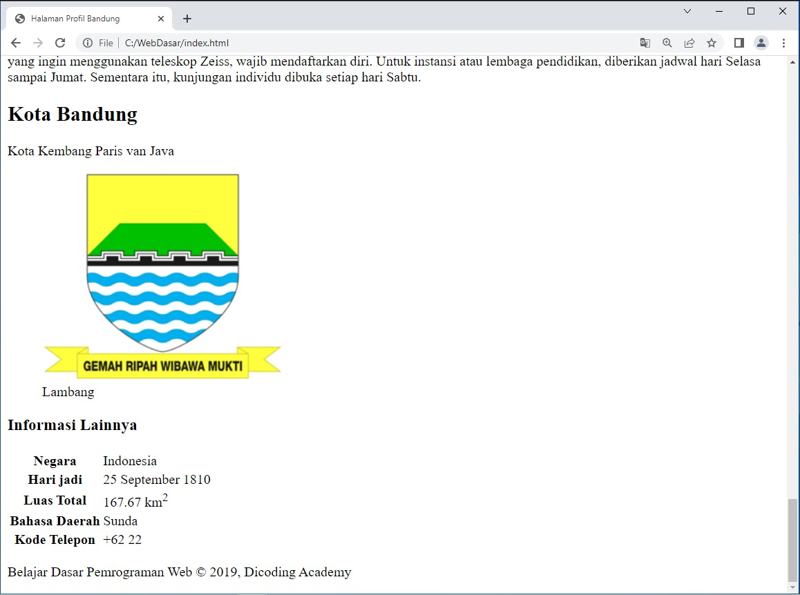
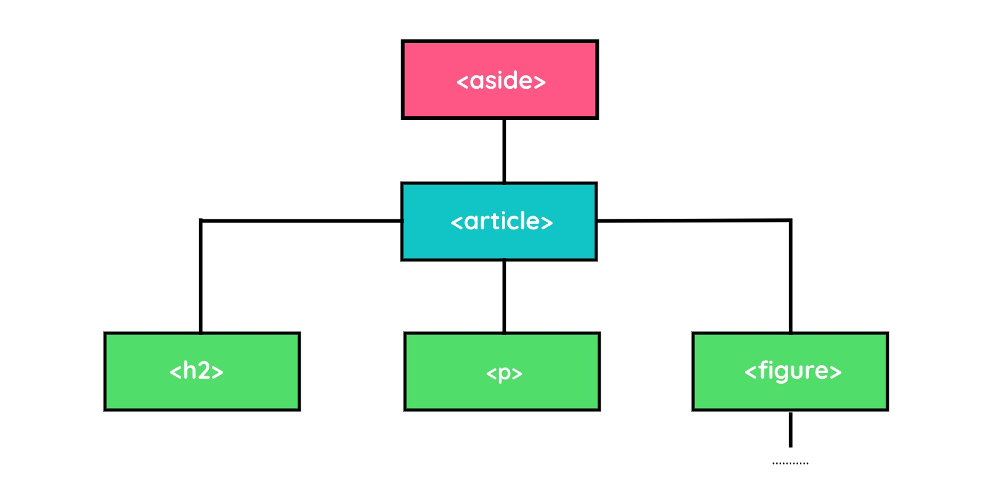
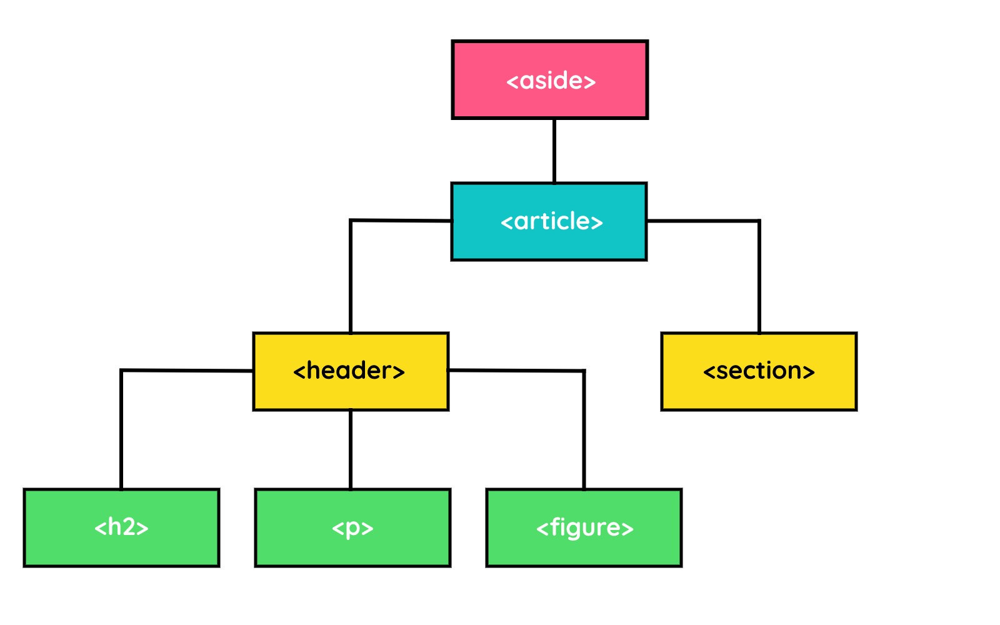
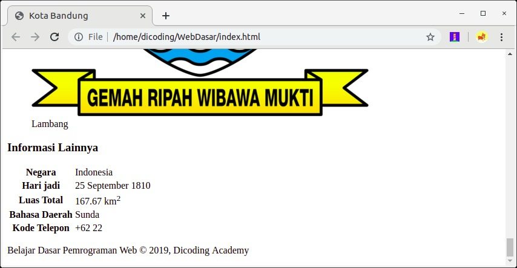

Latihan: Menerapkan Elemen Tabel pada Halaman Profil
Pada latihan ini, kita akan menerapkan elemen tabel pada Halaman Profil setelah belajar dasar-dasar membuat tabel di halaman web. Nah, sudah penasaran, kan, manfaat dari elemen <table> terhadap Halaman Profil Bandung? 

Tujuan
Pada latihan ini, kita akan menerapkan elemen table dalam Halaman Profil. Apakah Anda memiliki gambaran yang akan kita tampilkan dengan elemen table? Kita akan menampilkan data-data bandung lainnya, seperti negara bertempat, hari ultah, luas wilayah, bahasa lokal, dan kode telepon. Konten-konten ini akan diletakkan satu elemen dengan Logo Bandung.

Seperti yang diketahui sebelumnya, elemen tabel tidak memiliki ukuran border sama sekali. Kita akan menampilkan data-data di atas tanpa border. Kurang lebih, hasil akhir akan seperti berikut.

Alur Latihan
Berikut adalah alur latihan kali ini.

Membuka hasil latihan terakhir dengan VSCode.
Membungkus elemen-elemen yang ada saat ini dengan <header>.
Menambahkan konten-konten baru dengan elemen <section>.
Menampilkan konten-konten yang baru dengan elemen <table>.
Menjalankan dokumen HTML pada browser.
Latihan Identifikasi Elemen pada Halaman Website

# Silakan ikuti dan simak beberapa langkah berikut untuk mengikuti latihan dengan baik.

1. Silakan buka proyek Halaman Profil terakhir dengan VSCode. Jika belum memilikinya, silakan Anda unduh dan buka proyek tersebut pada GitHub repository ini.
2. Sebelum kita menambahkan konten ke HTML, mari kita atur kembali struktur elemen dalam elemen <aside> tersebut. Saat ini, elemen <aside> memiliki struktur seperti berikut.

3. Kita perlu mengelompokkan kembali elemen yang ada di dalam elemen <article> karena akan menambahkan konten lain. Kelompokkan seluruh elemen yang ada pada elemen <article> saat ini sebagai header dan tambahkan elemen baru di bawah elemen header tersebut, yaitu <section>.

Pada elemen <section>, konten tabel akan ditempatkan. Silakan buka kembali berkas index.html dan sesuaikan struktur elemen <aside> seperti berikut.

4. Struktur elemen pada elemen <aside> akan menjadi seperti bagan berikut.

5. Sip, lanjut! Pada elemen <section>, kita masukkan konten berikut padanya

formasi Lainnya
Negara          Indonesia
Hari jadi       25 September 1810
Luas Total      167.67 km2
Bahasa Daerah   Sunda
Kode Telepon    +62 22

6. Itulah konten yang akan ditampilkan dalam <aside>. Sesuaikan konten tersebut dengan menerapkan elemen yang tepat, salah satunya gunakan elemen tabel untuk menampung sebagian kontennya. Silakan sesuaikan kodenya dengan kode bercetak tebal berikut.

7. Hasilnya akan seperti berikut setelah dijalankan.

Luar biasa! Kita sudah berjaya mengimplementasikan elemen <table> untuk membuat tabel dalam halaman web. Kali ini, kita sudah paham cara membuat data tabulasi. Kamu bisa menambahkan informasi apa pun selain yang telah diajarkan dalam latihan ini. Semangat!

