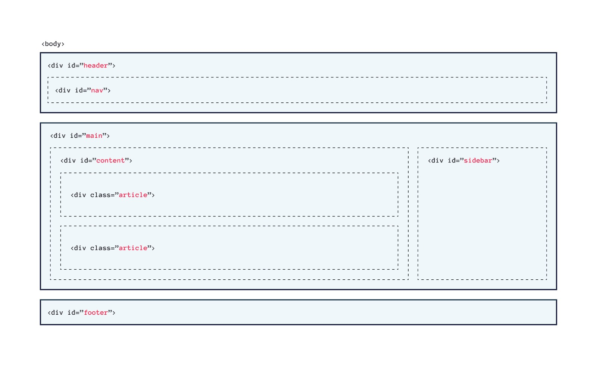
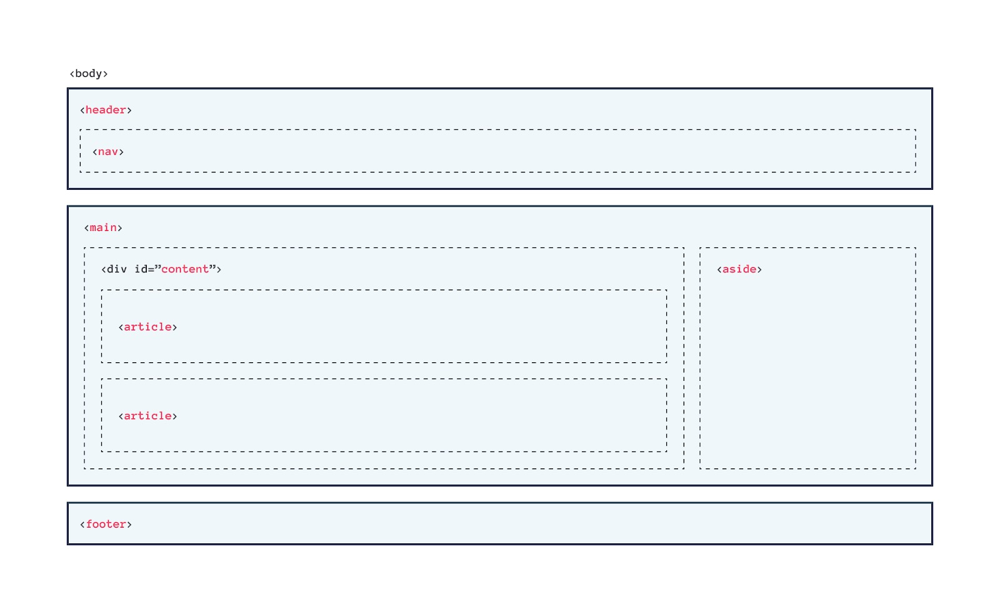

# Semantic HTML: Mengorganisasi Halaman Konten
Sebagaimana sudah disebutkan pada modul sebelumnya, sebuah website memiliki hierarki konten yang sama seperti dokumen sehari-hari yang kita baca, majalah, dan koran contohnya. Jadi, hierarki pada sebuah website merupakan hal yang penting. Tentu elemen yang terdapat pada HTML perlu kita kelompokkan menjadi beberapa bagian.

Sebelum HTML5, kita mengelompokkan suatu elemen HTML yang memiliki konten serupa dalam sebuah generic element 
 (kita akan membahas div secara dalam nanti). Kita mengelompokkan sebuah header website dengan menggunakan div, membuat sebuah navigation dengan menggunakan div juga, artikel atau section yang lainnya. Kita biasa gunakan class atau id untuk mengindikasikan peran dari elemen tersebut. Hal ini membuat struktur pada website hilang (semantic meaningless).

Dalam HTML5, kita dikenalkan pada beberapa elemen yang dapat digunakan untuk mengelompokkan sebuah elemen dengan lebih jelas dan memiliki arti (semantic meaning). Elemen-elemen ini memiliki nama sesuai dengan fungsi atau peran dari elemen tersebut.

Kedua contoh gambar di atas menunjukkan struktur halaman yang sama. Pada contoh pertama banyak elemen 
 yang dapat diubah dengan layout elemen HTML5.

