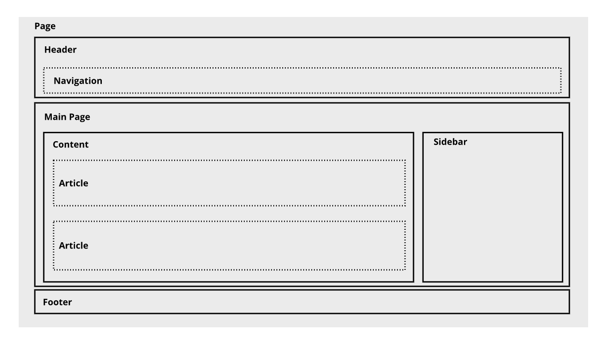

# Semantic HTML: Mengorganisasi Halaman Konten
Sebagaimana sudah disebutkan pada modul sebelumnya, sebuah website memiliki hierarki konten yang sama seperti dokumen sehari-hari yang kita baca, majalah, dan koran contohnya. Jadi, hierarki pada sebuah website merupakan hal yang penting. Tentu elemen yang terdapat pada HTML perlu kita kelompokkan menjadi beberapa bagian.

