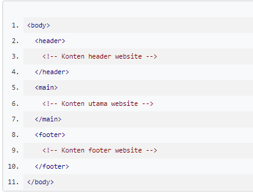

# Main
Element <main> digunakan untuk menampung/mewadahi konten utama (dominan) dalam <body>. Konten main dapat terdiri dari banyak section, ataupun artikel, atau konten apa pun di dalam elemen main, selama ia termasuk konten utama yang dimiliki oleh website.

Karena elemen <main> berisi inti konten pada website, jangan gunakan elemen main lebih dari satu pada berkas HTML. 