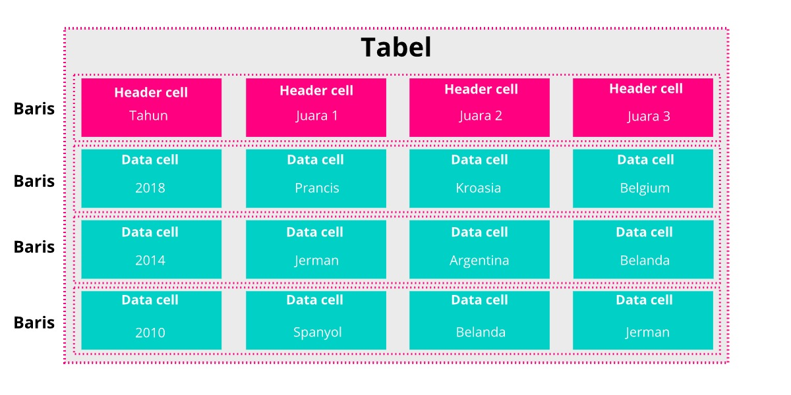
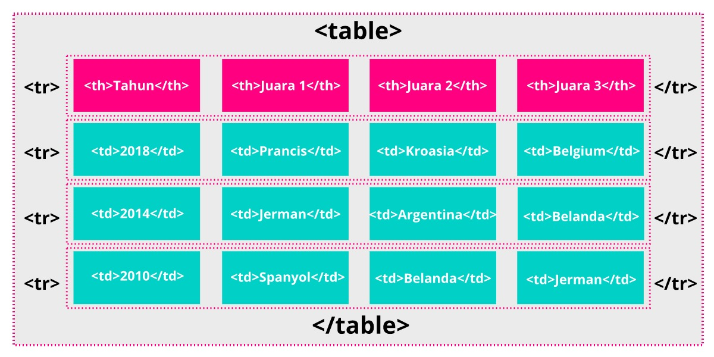

# Struktur Dasar Tabel
Tabel pada HTML disusun dari tiga buah elemen, yaitu <table>, <tr> dan <td> atau <th>. Elemen <table> digunakan untuk menandakan dimulainya dan diakhirinya sebuah konten tabel dan juga sebagai wadah untuk tabel itu sendiri. Kemudian elemen <tr> digunakan untuk membuat sebuah baris baru yang di dalamnya terdapat elemen <td> atau <th> sehingga menghasilkan sebuah sel. 

Elemen <td> berarti “table data”. Selain membuat sel, elemen ini juga merupakan tempat menampung data pada tabel, dan elemen <th> atau “table header” digunakan untuk menentukan sebuah header pada kolom datanya. Untuk lebih jelasnya, perhatikan ilustrasi berikut.

Cukup mudah, kan? Sekarang mari kita ubah menjadi penerapan elemen HTML.

Berdasarkan ilustrasi di atas, kita dapat menuliskan sebuah struktur dasar tabel pada HTML seperti berikut.

<h1>Pemenang Piala Dunia Tiga Tahun Terakhir</h1>
    <table>
        <tr>
            <th>Tahun</th>
            <th>Juara 1</th>
            <th>Juara 2</th>
            <th>Juara 3</th>
        </tr>
        <tr>
            <td>2020</td>
            <td>burhan fc</td>
            <td>kolak fc</td>
            <td>datage fc</td>
        </tr>

        <tr>
            <td>20201</td>
            <td>burhan fc</td>
            <td>kolak fc</td>
            <td>datage fc</td>
        </tr>

        <tr>
            <td>2022</td>
            <td>burhan fc</td>
            <td>kolak fc</td>
            <td>datage fc</td>
        </tr>
    </table>

Hal yang perlu kita ingat lagi, seluruh konten atau data dituliskan pada elemen <td> ataupun <th>. Kita bisa memberikan konten apa saja di dalamnya, seperti teks, gambar, atau bahkan sebuah tabel lainnya.
