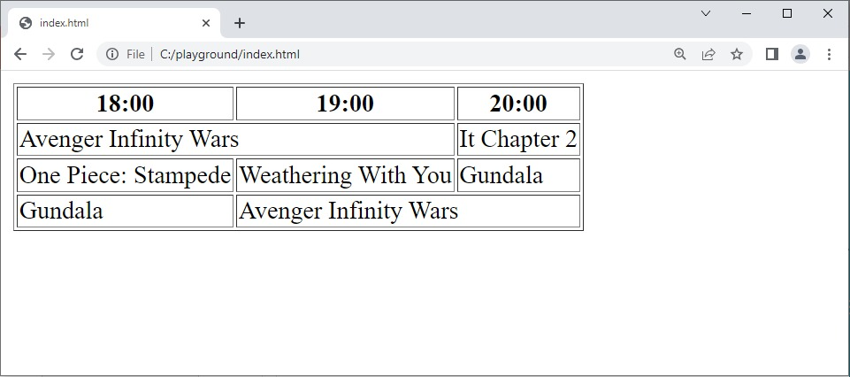

# Column Spans
Untuk merentangkan sebuah kolom (column spanning) kita bisa menggunakan atribut colspan pada elemen <td> atau <th>. Berikut adalah contoh untuk penggunaan colspan sehingga sebuah header mencakup dua kolom.

<table>
    <tr>
        <th>18:00</th>
        <th>19:00</th>
        <th>20:00</th>
    </tr>

    <tr>
        <td colspan="2">Avenger Infinity Wars</td>
        <td>It Chapter 2</td>
    </tr>

    <tr>
        <td>One Piece: Stampede</td>
        <td>Weathering With You</td>
        <td>Gundala</td>
    </tr>

    <tr>
        <td>Gundala</td>
        <td colspan="2">Avenger Infinity Wars</td>
      </tr>
</table>

Sebuah elemen yang menggunakan atribut colspan akan mencakup ruang kolom sesuai nilai dari atribut itu sendiri. Untuk lebih jelasnya, kita bisa menambahkan atribut border pada elemen <table> agar terdapat garis pada tepi selnya. Ingin mencobanya? Silakan lakukan pada interactive code di atas. Seharusnya hasilnya akan seperti gambar berikut.

