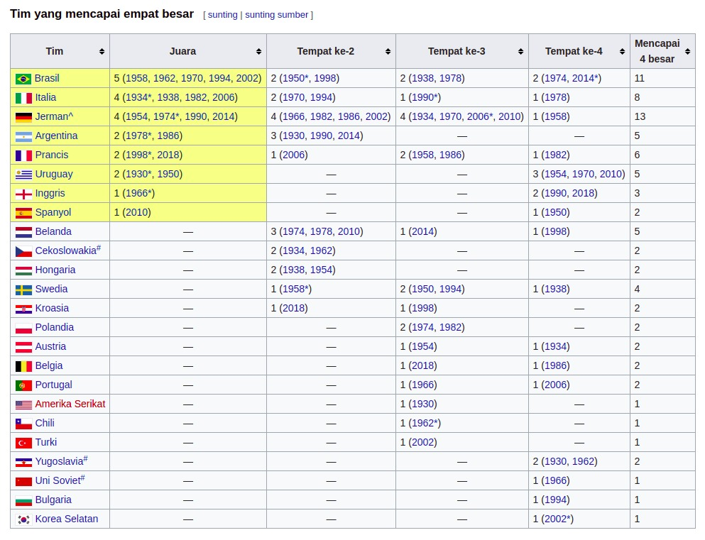

# Tabel
Ada beberapa jenis informasi yang perlu ditampilkan dalam bentuk tabel, contohnya klasemen olahraga atau sebuah jadwal layaknya kalender. Ketika kita membuat sebuah tabel, pastinya kita akan banyak bermain dengan baris dan kolom. Pada materi ini, kita akan belajar cara membuat dan mengorganisasi sebuah tabel pada HTML.

Namun, sebelum itu, apa sih sebenarnya tabel dalam HTML itu? Elemen <table> pada HTML merepresentasikan data tabular, yaitu informasi yang disajikan dalam sebuah tabel. Tabel sendiri disajikan dalam dua dimensi terdiri dari baris dan kolom (cell) yang berisikan sebuah data. Berikut adalah contoh data sepak bola yang disajikan dalam bentuk tabel.

