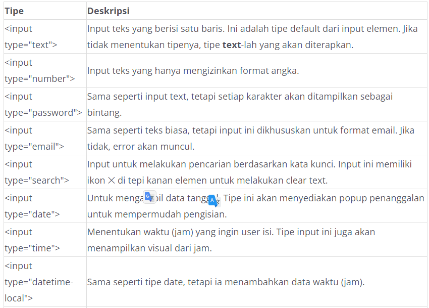
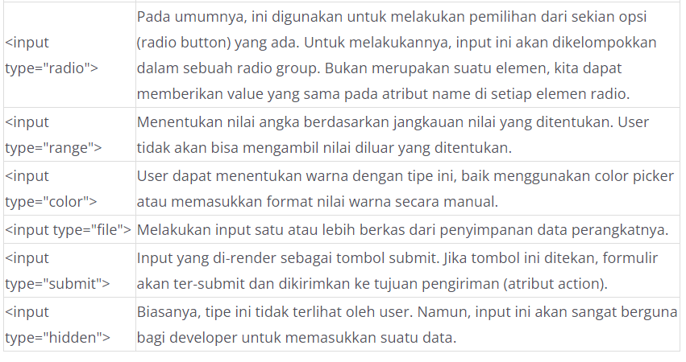

# Input Element
Elemen <input> merupakan elemen yang sangat sering dipakai untuk mendapatkan data dari user. Mengapa hal tersebut terjadi? Hal ini karena elemen input memiliki banyak sekali tipe-tipenya, mulai dari teks, password, email, search, file, dsb. Tidak hanya itu, dari sekian tipe input, masing-masingnya juga didukung oleh atribut khusus sehingga pembuatan formulir semakin powerful.

Berikut adalah contoh penerapan dari input element.

  Text:
  <input type="text" />

  Number:
  <input type="number" />

  Email:
  <input type="email" />

  Password:
  <input type="password" />

Selain tipe-tipe input di atas, ada banyak tipe lainnya yang tersedia. Selengkapnya, Anda dapat lihat pada tabel berikut.

Tidak semua elemen input di atas memiliki tampilan yang relatif sama. Hal yang dimaksud adalah berbentuk kotak (border) yang di dalamnya berisi data seperti input text. Beberapa tipe elemen, seperti radio, checkbox, file, dan hidden memiliki tampilan khusus.

Jika penasaran, Anda dapat praktik mandiri pada interactive code berikut. Anda dapat mengubah tipe inputnya untuk melihat hasilnya.