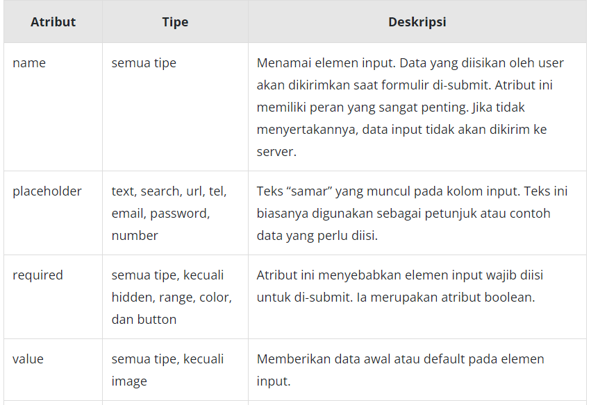
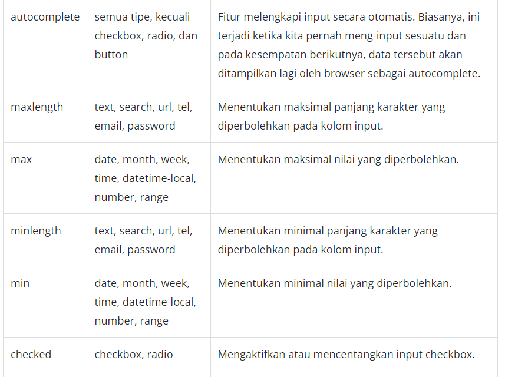
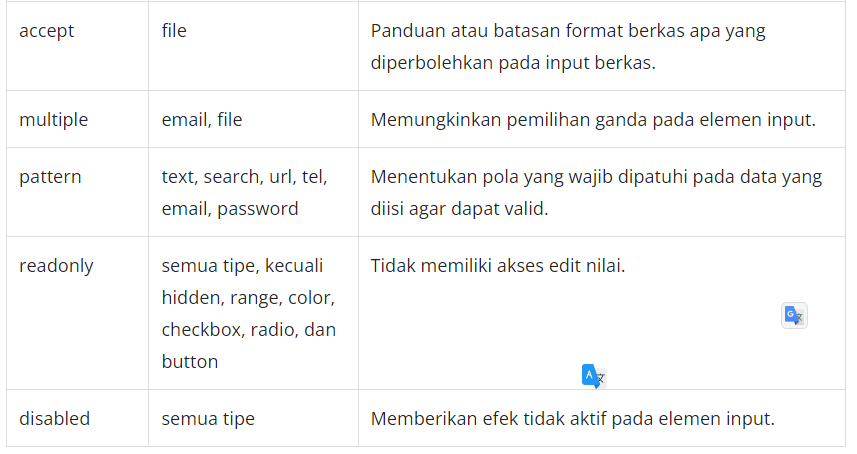

# Atribut pada Elemen Input
Banyak sekali tipe dari elemen input yang dirancang untuk mengatasi beragam kasus data. Bahkan, pewarnaan pun disediakan oleh HTML dengan berbagai variasi nilai (RBG, Hex, dsb.). Pembahasan tentang input element tidak hanya sampai di situ. Ada hal lain yang perlu dibahas dan diketahui untuk memaksimalkan pembuatan formulir di website. Sudah siap, kan?

Sebelumnya, kita sempat menyinggung bahwa atribut yang didukung sangat beragam selain tipe elemen input. Ada atribut yang bekerja untuk semua tipe input dan ada atribut yang hanya dikhususkan bagi satu tipe.

Berikut adalah contoh penerapan atribut placeholder dan required.

    <label for="emai">email</label>
     
    <input type="text" id="email" placeholder="Email@etc.com">

    <label for="password">password</label>
     
    <input type="password" id="password" placeholder="********">

    

Dua atribut di atas merupakan atribut yang sering dimanfaatkan ketika membuat formulir. Atribut placeholder digunakan untuk memberikan contoh atau referensi data sebagai panduan user mengisi data, sedangkan atribut required menandakan bahwa elemen input tersebut wajib diisi.

# Catatan:
Elemen label tidak dapat digantikan oleh atribut placeholder. Kedua hal ini memiliki peranannya sendiri dalam membuat formulir. Placeholder berfungsi sebagai petunjuk user dalam mengisi data, bukan untuk memberi keterangan atau caption elemen input.

Berikut adalah beberapa atribut yang menurut kami sering digunakan ketika membangun formulir.

Ada banyak sekali atribut-atribut yang tersedia. Tidak hanya memberikan fitur lebih, beberapa atribut lainnya dapat mengaktifkan proses validasi terhadap data yang dimasukkan user, seperti required, pattern, max, maxlength, dsb.

Jika Anda ingat, menentukan tipe pada elemen input merupakan salah satu penerapan validasi. Contohnya, jika Anda menerapkan tipe email dan tidak mengisi data dengan email valid, sebuah popup error akan muncul untuk memberi petunjuk pada user agar data yang dimasukkan valid.

Itulah beberapa atribut pada elemen input yang dapat dimanfaatkan untuk memberikan kemampuan yang lebih dari sekadar input biasa.

Berikut kami sajikan beberapa referensi yang dapat disimak untuk menambah wawasan Anda.

https://www.the-art-of-web.com/html/html5-form-validation/

https://web.dev/learn/forms/validation/