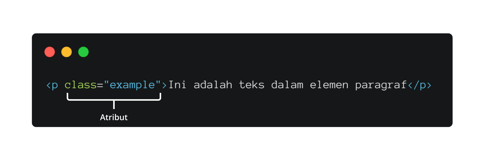

# Attribute di Elemen HTML
Sebelumnya, kita sudah membahas elemen HTML beserta anatominya. Nah, ada satu bahasan lainnya yang belum kita pelajari, yaitu atribut. Nah, mari kita simak pembahasannya.

Dalam membuat elemen HTML, ada satu hal yang dapat dilakukan, yaitu memberi atribut. Atribut dapat memberi informasi-informasi tambahan untuk elemen HTML. Informasi ini tidak akan tampil dalam halaman web, tetapi ia dapat menentukan perilaku elemen biasanya.

Contohnya, ada satu elemen yang berfungsi untuk menampilkan gambar sebagai konten halaman web, yaitu . Nah, kita perlu menyertakan informasi pada elemen tersebut, yaitu alamat dari gambar yang akan ditampilkan.

Pada gambar di atas, atribut src menentukan lokasi gambar yang akan ditampilkan pada halaman web.

Dari contoh di atas, mungkin Anda sudah terbayang bentuk penerapan atribut HTML. Namun, berikut adalah anatomi dari atribut elemen untuk memperjelas pemahaman Anda.

Pada gambar di atas, kita memiliki atribut class. Secara singkat, atribut ini merupakan sebuah nama identitas yang digunakan untuk menargetkan elemen dengan kode styling. Untuk pembahasan styling akan dicakup pada modul terpisah.

Ada dua hal yang dilakukan untuk menambahkan atribut pada elemen HTML, yaitu nama atribut dan nilainya. Ada banyak atribut yang disediakan oleh HTML. Salah satu yang terlihat sebelumnya adalah class dan src. Terkait nilainya, Anda dapat menulisnya dengan membungkus dengan tanda kutip satu atau dua setelah karakter sama dengan (=).

Berikut adalah beberapa atribut yang tersedia di HTML.

Itulah pembahasan mengenai anatomi elemen HTML. Elemen ini memiliki peran yang sangat besar terhadap browser agar informasi-informasi dapat ditampilkan dengan baik. Untuk menambah wawasan, ada artikel yang menyebutkan atribut-atribut yang dapat digunakan.