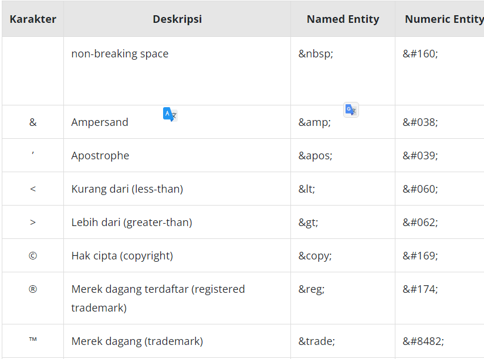
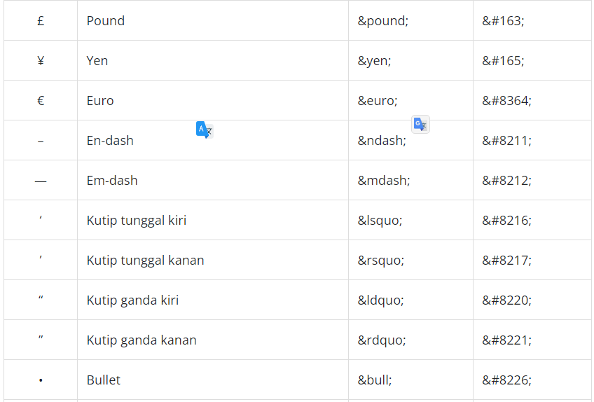
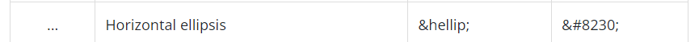

Ada beberapa karakter spesial seperti copyright symbol (©) yang tidak termasuk ke dalam standar kelompok ASCII characters. ASCII characters hanya menyediakan karakter seperti huruf, nomor, dan beberapa simbol dasar lainnya. Karakter lain, seperti lebih besar dari (>) atau lebih kecil dari (<), tidak dapat digunakan secara langsung sebagai konten pada HTML meskipun tersedia dalam ASCII character. Hal ini karena karakter tersebut akan terbaca sebagai sebuah tag.

Untuk menampilkan karakter seperti yang disebutkan tadi, HTML memerlukan sebuah “escaped” character. Escaping artinya tidak menulis karakter itu sendiri, tetapi ia diganti dengan nilai numeric atau character reference pada karakternya.

Ada dua cara untuk melakukannya, yakni menetapkan nilai numerik (numeric entity) atau menggunakan nama singkatan yang sudah ditetapkan untuk masing-masing karakternya (named entity). Semua referensi karakter dimulai dengan “&” dan diakhiri dengan “;”.

Contohnya, untuk menggunakan simbol copyright, kita dapat menggunakan “&copy;”.

Belajar Dasar Pemrograman Web &copy; 2023, Dicoding

Selain itu, kamu juga bisa gunakan “&#169;”.

Belajar Dasar Pemrograman Web &#169; 2023, Dicoding

Berikut adalah daftar karakter spesial dengan karakter referensinya.

