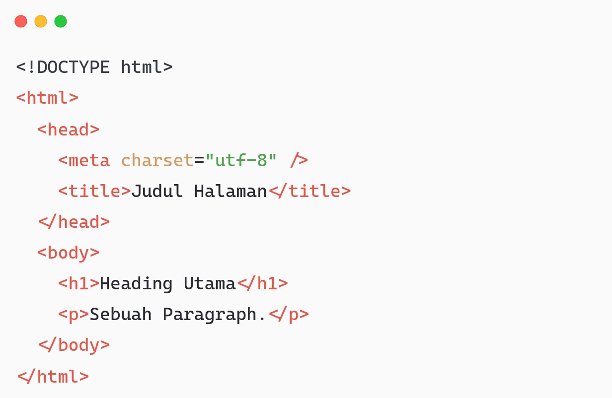
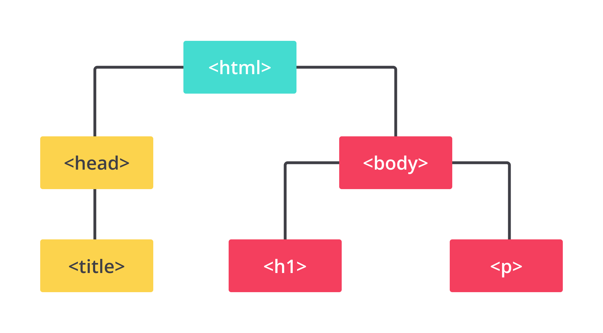

# Anatomi Dokumen HTML
Website serupa dengan dokumen konvensional yang ada. Serupa dalam arti memiliki struktur konten layaknya dokumen konvensional pada umumnya. Contohnya koran, majalah, atau buku. Selain itu, tidak jarang juga kita sering melihat artikel. Artikel memiliki beberapa komponen atau elemen, seperti judul, gambar, paragraf, dan sebagainya. Terkadang, jika konten artikel sangat panjang, pengelompokan akan dilakukan pada setiap bahasan menjadi beberapa bagian dengan memanfaatkan subjudul.

Judul dan subjudul pada sebuah dokumen menggambarkan suatu hierarki informasi. Misalnya, judul tingkat tertinggi merupakan judul utama dalam sebuah konten. Kemudian, diikuti dengan judul tingkat lebih rendah dan menjelaskan informasi dengan lebih rinci lagi.

Pada dasarnya, dokumen HTML memerlukan struktur dasar untuk menampilkan halaman web dengan baik. Halaman web seharusnya memiliki susunan elemen HTML yang tampak seperti berikut.

Pada pembahasan materi sebelumnya, kita mengetahui bahwa elemen dapat menjadi anak dari elemen lain atau biasa disebut child-element. Nah, contoh nyata yang dapat kita lihat adalah struktur dasar halaman web di atas. Contohnya, elemen <head> dan <body> merupakan child-element dari <html>. Lalu, elemen <head> memiliki child-element <title> yang memiliki konten berupa teks dari judul halaman yang ditampilkan. Elemen <body> memiliki child-element <h1> untuk menampilkan heading dan 
 untuk menampilkan paragraf.

Hal di atas sebetulnya akan membentuk sebuah hierarki elemen atau biasa disebut dengan DOM Tree (pohon DOM). Ini dapat Anda analogikan seperti silsilah keluarga.

# Doctype HTML
Sederhananya, doctype dimaksudkan sebagai format atau versi HTML dan berisi sekumpulan aturan-aturan yang perlu diikuti dalam membangun halaman web yang baik. Pada waktu lampau, dokumen HTML disusun seperti berikut.

# Elemen <html>
Hierarki elemen teratas dari halaman web adalah elemen <html>. Elemen ini digunakan untuk memberitahu browser bahwa ia merupakan sebuah berkas HTML sekaligus menjadi root dari halaman web. Seluruh elemen lain tentunya dituliskan di dalam elemen ini (child-element).

# Elemen <head>
Elemen <head> berfungsi sebagai tempat disimpannya informasi dari dokumen HTML. Informasi dapat berupa elemen meta, style, favicon, atau link. Selain itu, kita bisa memberikan judul dari halaman web (tab browser). Berikut adalah beberapa contoh elemen yang biasanya diletakkan dalam elemen ini.

* <title> 
* 
</head>

Namun, penggunaan <head> dapat dihilangkan sejak HTML5. Jadi, struktur dasar berkas HTML menjadi seperti berikut.
<!DOCTYPE html>
<html>
  <meta charset="utf-8">
  <title>Judul Halaman</title>
  
 
  <body>
    <h1>Judul Utama</h1>
    
Sebuah paragraf

  </body>
</html>

# Elemen <body>
Tahukah kamu, bagaimana konten dapat ditampilkan dan di mana peletakannya? Setiap konten atau elemen dalam elemen <body> akan ditampilkan dalam halaman web. Elemen apa pun, baik gambar, judul, daftar barang, paragraf, dsb., yang diletakkan dalam elemen ini akan muncul. Bahkan, teks yang tak dibungkus oleh elemen sekalipun. 

Silakan tuliskan kode berikut, simpan dalam format HTML, dan jalankan pada browser
<!DOCTYPE html>
<html>
  <head>
    <title>Judul Dokumen HTML</title>
  </head>
  <body>
    <h1>Heading yang Diletakkan dalam Elemen Body</h1>
    
Ini merupakan sebuah paragraf yang juga diletakkan pada elemen body. Konten ini dapat dilihat oleh pengguna pada jendela browser.

  </body>
</html>

Seluruh konten yang dituliskan pada body akan ditampilkan. Namun, ada kode yang tidak akan ditampilkan. Kode atau fitur yang dimaksud adalah komentar. Jika ingin menuliskan keterangan tambahan pada struktur dokumen HTML, kita perlu menggunakan commenting tag. Ini dituliskan dengan simbol <!-- sebagai pembuka dan --> sebagai penutupnya.

Semua yang dituliskan di antara tag komentar tidak akan memberikan pengaruh apa pun, termasuk tampilan di jendela browser. Berikut adalah contoh implementasi dari tag komentar.

# Lorem Ipsum Generator
Lorem ipsum adalah teks standar yang ditempatkan untuk mendemonstrasikan elemen grafis atau presentasi visual, seperti font, tipografi, dan tata letak. Tujuan penggunaan lorem ipsum sebagai berikut.

Sebagai pengisi sementara jika belum ada konten teks.
Jika ingin menunjukkan hasil website sementara yang mana audiens diharapkan lebih fokus kepada elemen desain yang dipresentasikan, bukan pada isinya (teks).
Penggunaan lorem ipsum biasanya digunakan pada proses pengembangan (development).
