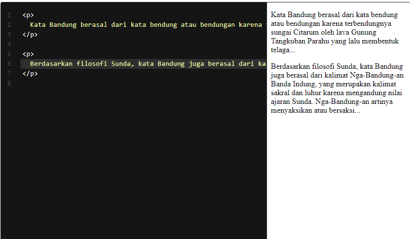

# Paragraf
Paragraf adalah elemen paling mendasar dari sebuah dokumen teks. Pada HTML, kita bisa menunjukkan sebuah paragraf dengan menggunakan elemen 
. Contohnya berikut.

Ketika menggunakan elemen paragraf, browser akan menampilkannya dalam baris baru dan sedikit jarak (space) di bawah elemen. Dalam CSS, ini disebut sebagai margin. Singkatnya, ia merupakan bagian dari elemen yang mengatur jarak antar elemen. Margin akan kita bahas dan atur pada penerapan styling.

Elemen paragraf tidak melulu menampilkan teks. Ia dapat berisi elemen lain yang memiliki sifat inline, seperti elemen gambar, input, dan sebagainya. Anda akan menemukan bahasan elemen inline pada materi-materi berikutnya.

Pada modul sebelumnya, Anda sudah berlatih mengidentifikasi elemen pada Halaman Profil Bandung. Sebagai catatan, gunakanlah elemen paragraf untuk konten bertipe paragraf. Bagi teks yang bersifat sebagai judul, jangan gunakan elemen ini meskipun tidak menjadi error. Hal ini karena ada elemen lain yang lebih cocok untuk hal tersebut. Namun, tidak perlu risau. Kita akan membahas elemen lainnya secara lengkap pada materi berikutnya.

