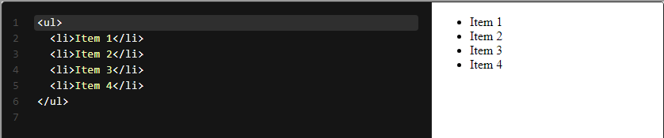
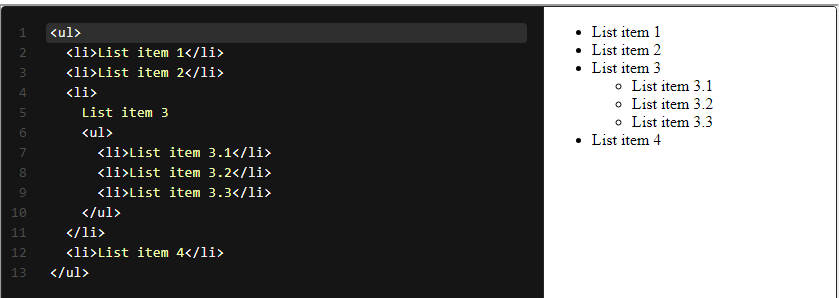
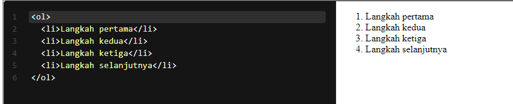
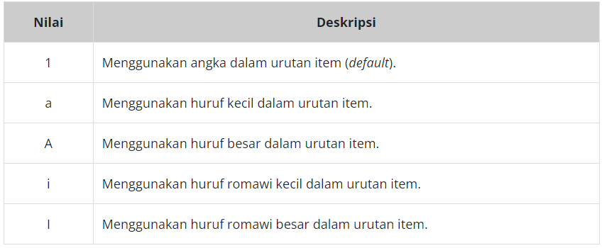
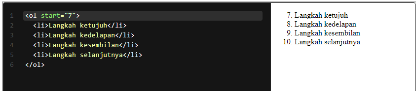
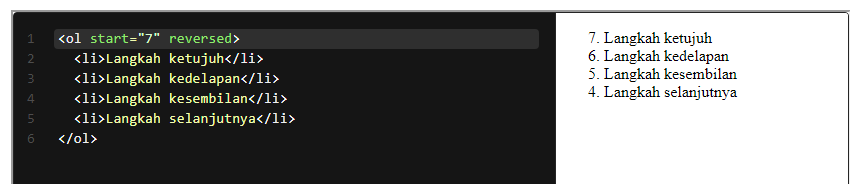

# List
Sebagaimana yang sudah disebutkan pada pembahasan paragraf, tidak semua teks dibungkus oleh paragraf, salah satunya list. Kita pun terbiasa membuat list dalam kehidupan sehari-hari, baik membuat to-do list maupun daftar yang terstruktur sekalipun. 

Pada HTML terdapat tiga tipe list.

* Unordered lists: daftar yang ditampilkan tidak memiliki urutan. 
* Ordered lists: daftar yang ditampilkan secara terurut.
* Description lists: daftar yang terbuat dari beberapa istilah diikuti dengan deskripsi dari istilah tersebut.

# Unordered List
Seperti namanya, unordered list merupakan daftar yang tidak mementingkan urutan. Standarnya, unordered list menampilkan bullet pada tiap item list-nya (tetapi kita bisa mengubahnya dengan styling).

Untuk menetapkan konten sebagai unordered list kita gunakan <ul></ul> kemudian di dalam elemen tersebut kita gunakan tags <li></li> untuk menetapkan item pada list tersebut. Contoh penerapannya sebagai berikut.

Di antara tag elemen <li>, kita dapat mengisikan konten apa pun termasuk elemen HTML lain. Contohnya, kita dapat memasukkan sebuah heading atau paragraf pada item.

<!-- kode -->
<ul>
  <li><h1>Sebuah Heading sebagai item list</h1></li>
  <li><h2>Sebuah Heading level 2 sebagai item list</h2></li>
  <li>
Sebuah paragraf sebagai item list
</li>
</ul>

Kita juga bisa menambahkan elemen <ul> lagi dalam list item untuk membuat nested list

# Ordered List
Ordered list digunakan untuk membuat list yang mementingkan urutan. Contohnya, membuat daftar instruksi langkah demi langkah sehingga dibutuhkan urutan yang sesuai. Ordered list bekerja seperti unordered list, tetapi perbedaannya adalah pada tiap item menampilkan angka bukan sebuah bullet. Angka yang ditampilkan, otomatis berurut tiap item-nya sehingga kita tidak perlu menuliskan secara kasar urutan nomornya. Hal ini tentu mempermudah kita untuk mengorganisasi tiap itemnya.

Untuk menetapkan konten sebagai ordered list kita gunakan <ol></ol>. Sama seperti unordered list, tiap item dalam list ditetapkan dengan menggunakan tags <li></li>.

Sebagaimana unordered list, di antara tag elemen <li>, kita dapat mengisikan konten apa pun termasuk elemen HTML lain.

Pada ordered list, tipe urutan angkanya dapat kita atur melalui sebuah atribut type. Contohnya, selain nomor, urutan angka dapat diganti dengan alfabet ataupun angka romawi.

<!-- kode -->
<ol type="I">
  <li>Langkah pertama</li>
  <li>Langkah kedua</li>
  <li>Langkah ketiga</li>
  <li>Langkah selanjutnya</li>
</ol>
 
<ol type="A">
  <li>Langkah pertama</li>
  <li>Langkah kedua</li>
  <li>Langkah ketiga</li>
  <li>Langkah selanjutnya</li>
</ol>

Berikut adalah nilai-nilai yang dapat digunakan pada atribut type pada elemen <ol>.

Selain tipe angka pada urutan, kita juga bisa menetapkan nilai awal pada sebuah ordered list dengan menggunakan atribut start. Contohnya, jika kita ingin memulai sebuah list dari angka 7, kita tetapkan atribut start dengan nilai 7 pada elemen <ol>.

Secara default, urutan list diawali dengan urutan paling rendah. Namun, kita dapat menambahkan atribut reversed pada elemen <ol> untuk membuat urutan dalam sebuah list terbalik. Atribut ini berbeda dengan atribut yang lain (yang sudah dibahas sebelumnya), atribut ini tidak memerlukan sebuah nilai ketika menggunakannya. Atribut ini hanya menandakan sebuah list untuk membalikkan urutan angka pada tiap item-nya. Berikut contoh penggunaannya.

