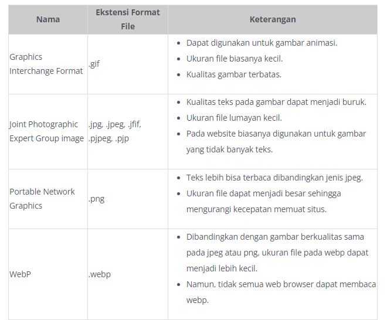
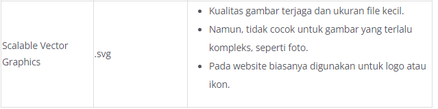
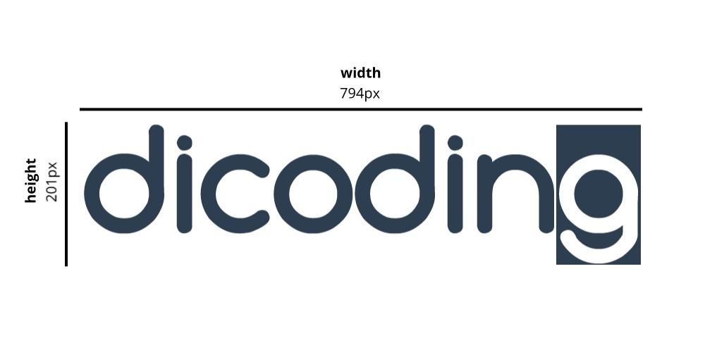
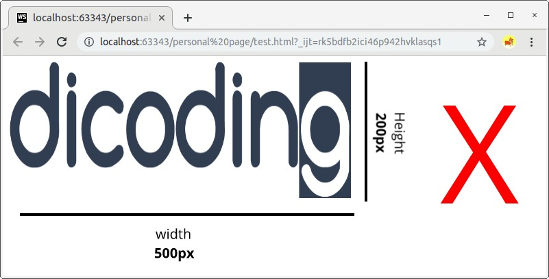
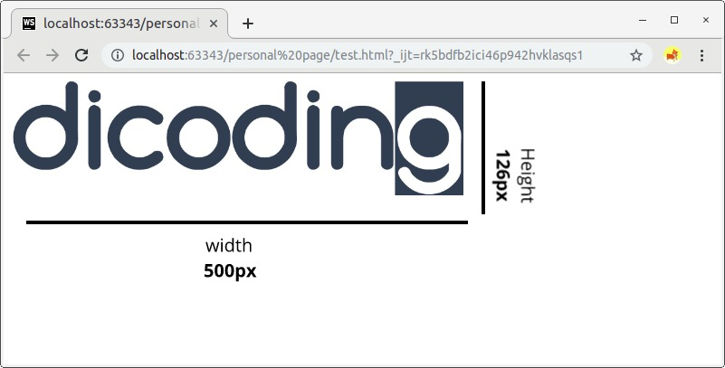
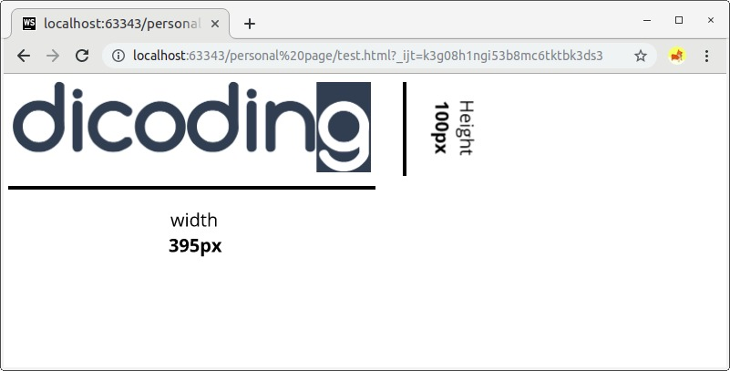

# Gambar
Tanpa gambar, sebuah website tentu tidak akan menarik bukan? Ada beberapa alasan mengapa website perlu gambar. Contohnya kita perlu menampilkan logo perusahaan, ilustrasi, diagram struktur atau data, dan sebagainya. 

Pada HTML untuk menampilkan sebuah gambar kita bisa menggunakan tag . Berbeda dengan elemen lain, elemen  tidak menuliskan konten di antara tag pembuka dan tag penutup. Namun, untuk menetapkan gambar yang ditampilkan kita gunakan sebuah atribut. 

# Jenis format gambar
Berikut adalah jenis format gambar yang umum digunakan pada pembuatan website

# Mengatur Ukuran pada Gambar
Untuk mengatur ukuran gambar yang ditampilkan, kita juga tentunya menggunakan sebuah atribut. Untuk menentukan lebar gambar, kita gunakan atribut width, dan untuk menentukan tinggi tentu gunakan atribut height.

Ketika menggunakan atribut ini, disarankan hanya gunakan salah satunya. Terkecuali kita menentukan nilai lebar dan tingginya sesuai dengan rasio dari ukuran gambar aslinya. 

Contohnya, jika kita tetap memaksa untuk menentukan ukuran panjang dan lebar sebuah gambar tanpa menyesuaikan rasionya, gambar yang ditampilkan tidak akan proporsional.

<!-- Jangan lakukan hal ini! -->

Hasilnya berikut.

Dengan menetapkan hanya satu atribut ukurannya, maka ukuran lainnya akan mengikuti sesuai dengan rasio gambar aslinya. Contohnya, kita bisa menetapkan ukuran gambar berdasarkan nilai lebarnya saja.

<!-- Menetapkan ukuran gambar berdasarkan lebar -->

Opsi lainnya, kita juga bisa tetapkan ukuran gambar berdasarkan tingginya. Dengan begitu nilai lebar akan menyesuaikan nilainya berdasarkan rasio gambar aslinya

<!-- Menetapkan ukuran gambar berdasarkan tinggi -->

