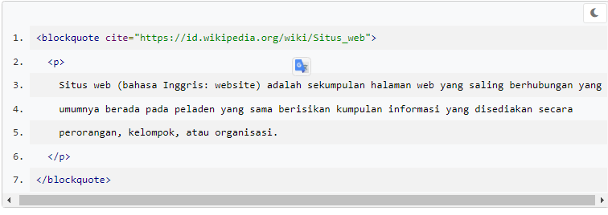

# Inline Formatting Text: Long Quotations, Preformatted Text, dan Figure
Sejauh ini, kita sudah mengenal paragraf, heading, dan juga list pada HTML. Tapi masih ada beberapa lagi yang merupakan spesial teks format yang dapat kita gunakan yaitu <blockquote>, <pre> dan <figure>.

Jika pada konten kita memiliki sebuah kutipan ataupun sebuah testimonial, kita dapat gunakan format long quotations dengan menggunakan tags (blockquote). Konten di dalam elemen (blockquote) ini dapat berupa sebuah paragraf, heading, ataupun list.

tanda ini () adalah syntac taq<>

Pada elemen ini, kita dapat menggunakan atribut cite untuk menentukan sumber URL dari sebuah kutipan (jika kutipan tersebut bersumber dari sebuah situs website). Namun, tidak ada tampilan yang berbeda pada browser secara kasat mata.

