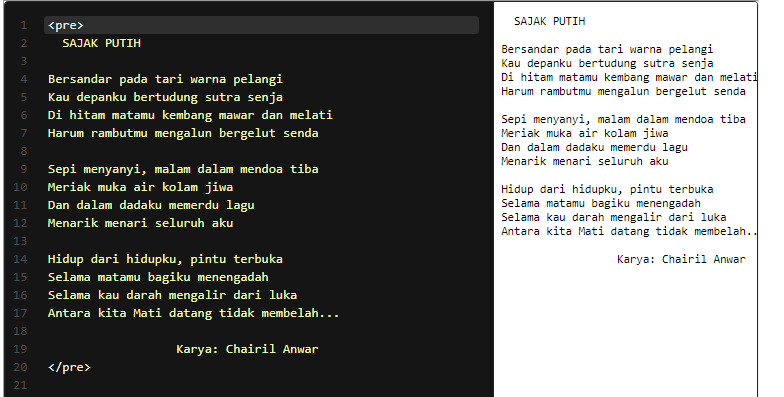

Pada modul sebelumnya, kita sudah mengetahui bahwa HTML akan mengabaikan spasi yang dituliskan secara berulang dan juga line breaks (garis baru). Namun, pada beberapa tipe konten, seperti contoh kode atau puisi hal tersebut sangat berarti.

Dengan begitu, terdapat sebuah elemen yang dapat kita gunakan untuk menampilkan konten sesuai yang kita tulis pada text editor. Untuk menggunakannya, kita gunakan elemen <pre> sebagai pembungkus kontennya. Perhatikan contoh berikut.

