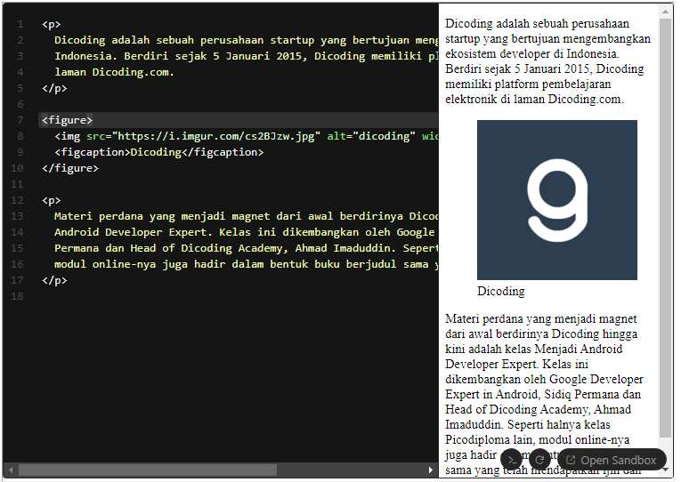
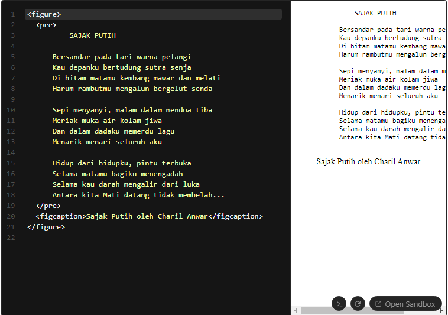

Elemen <figure> digunakan untuk mempresentasikan konten tersendiri (self-contained content), seperti ilustrasi, diagram, foto, atau bisa juga sebuah baris kode. Banyak hal yang dapat digunakan dalam elemen ini. 

Elemen ini digunakan untuk mengelompokkan blok konten yang dapat dipindahkan posisinya dari blok utama sebuah dokumen tanpa mempengaruhi arti dari induk dokumen.

Dalam elemen figure, kita dapat menuliskan elemen <figcaption> sebagai sebuah caption (judul) untuk konten tersebut. Berikut adalah contoh penggunaan figure pada sebuah konten gambar.

<!-- contoh code nya -->

  Dicoding adalah sebuah perusahaan startup yang bertujuan mengembangkan ekosistem developer di
  Indonesia. Berdiri sejak 5 Januari 2015, Dicoding memiliki platform pembelajaran elektronik di
  laman Dicoding.com.

<figure>
  
  <figcaption>Dicoding</figcaption>
</figure>

  Materi perdana yang menjadi magnet dari awal berdirinya Dicoding hingga kini adalah kelas Menjadi
  Android Developer Expert. Kelas ini dikembangkan oleh Google Developer Expert in Android, Sidiq
  Permana dan Head of Dicoding Academy, Ahmad Imaduddin. Seperti halnya kelas Picodiploma lain,
  modul online-nya juga hadir dalam bentuk buku berjudul sama yang telah mendapatkan ijin dan ISBN.

<!-- gambar nya -->

Contoh lainnya, elemen figure dapat kita gunakan untuk me-markup sebuah konten puisi.

