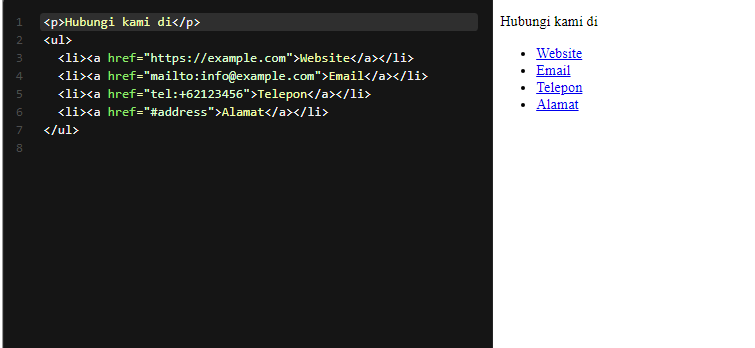
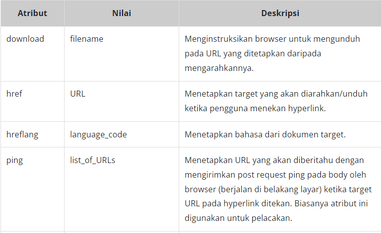
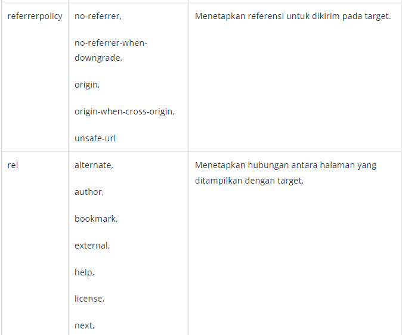
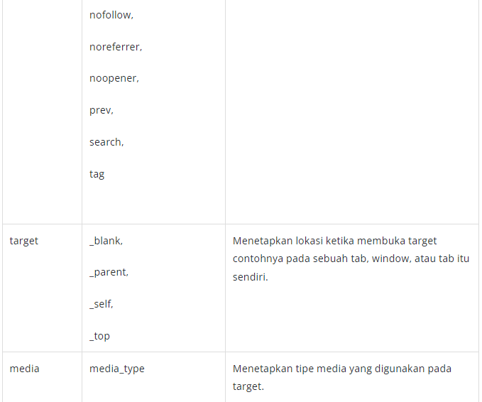

# Inline Formatting Text: Anchor, Emphasized Text, Important Text, dan Short Quotation
Kita sudah belajar mengidentifikasi penggunaan elemen pada konten yang mayor (besar) dengan menerapkan semantic HTML untuk mengorganisasi kontennya. Sekarang, kita akan mengenal beberapa formatting text yang digunakan dalam sebuah baris teks (inline teks). 

Sebelum menjelaskan elemen inline untuk formatting text yang dapat digunakan, sepertinya kita perlu membahas sekilas mengenai block dan inline.

Pada standarnya, elemen HTML memiliki dua sifat, yaitu block dan inline. Elemen yang bersifat block selalu membuat baris baru ketika di-render. Contohnya seperti elemen paragraf, list, heading, dan lainnya. Lawan dari elemen tersebut, yaitu elemen inline. Elemen ini tidak menambahkan baris baru ketika di-render. Apa saja elemen tersebut? Mari kita bahas satu persatu.

# Anchor
Apa itu anchor? Anchor (jangkar) merupakan elemen yang digunakan untuk membuat sebuah hyperlink ke halaman atau website lain, file, alamat email, atau URL lainnya. Untuk menggunakan elemen ini kita gunakan <a> sebagai tag pembuka dan </a> sebagai tag penutup. Selain itu, ada atribut wajib agar elemen ini berfungsi dengan baik, yaitu href untuk menetapkan sebuah target yang dituju. 

Berikut adalah daftar atribut khusus yang dapat digunakan pada elemen ini.

