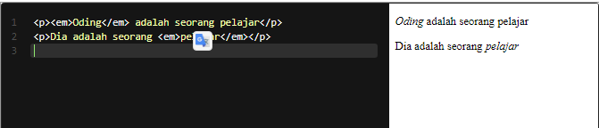

# Emphasized Text
Gunakan elemen <em> untuk menunjukkan bagian kata yang perlu kita tekankan. Elemen ini menunjukkan stress emphasis atau konten/kata yang perlu mendapatkan penekanan atau perhatian khusus. Berikut contoh penggunaannya.

Pada kalimat pertama, penekanan terdapat pada “siapa” seorang pelajar. Pada kalimat kedua, penekanan terdapat pada “apa” yang sedang ditekuni oleh Oding.

Standarnya, pada browser sebuah kata yang ditekankan akan ditampilkan dalam gaya miring pada teksnya.

