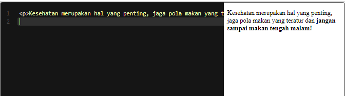

# Important Text
Gunakan elemen <strong> untuk menunjukkan sebuah teks yang begitu penting (strong importance), serius ataupun mendesak. Artinya, teks tersebut harus dapat perhatian lebih dari teks biasa lainnya.

Standarnya, pada browser sebuah teks yang diberi markup <strong> akan ditampilkan tebal. Lalu, ketika pengguna menggunakan pembaca layar (screen reader), suara yang terdengar akan berbeda. Ini mengartikan bahwa teks tersebut penting, tidak hanya sekadar tebal.