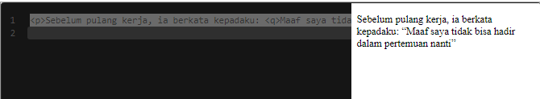
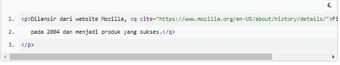

# Short Quotations
Gunakan elemen <q> untuk menandai sebuah kutipan dalam sebuah teks. Elemen ini berbeda dengan <blockquote>. Elemen ini digunakan untuk kutipan pendek yang terletak di dalam baris (inline).

Standarnya, sebuah teks yang diberi markup <q> akan ditampilkan di dalam tanda kutip (quotation marks) pada browser.

Elemen quotation marks memiliki atribut cite untuk menentukan sumber URL dari sebuah kutipan (jika kutipan tersebut bersumber dari sebuah situs website). Namun, tidak ada perbedaan yang terlihat secara kasat mata jika dijalankan di browser.

