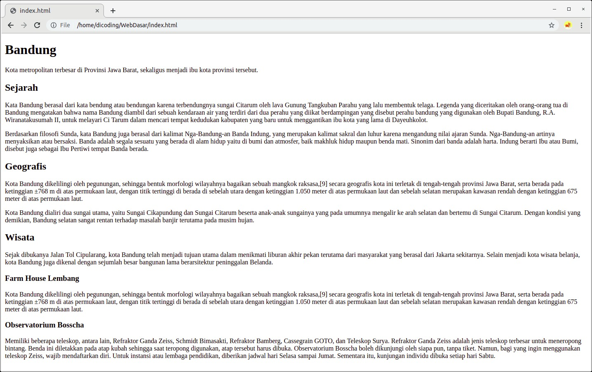

Pengantar HTML
Pada modul sebelumnya, Anda sudah belajar banyak hal sebagai penuntun Anda memasuki front-end web development. Ada banyak pengetahuan yang telah diserap, seperti cara internet bekerja, website dan halaman web, web server, dan web browser. Selain itu, kamu juga sudah memahami anatomi dari website sehingga memahami komponen vital pembangun website. Nah, saat ini, seharusnya Anda sudah siap untuk memulai gathering knowledge tentang teknik pembangunan aplikasi web.

Apakah Anda masih ingat HTML? Ia merupakan satu-satunya bahasa markup untuk membangun struktur halaman website. Sebagaimana telah dipelajari sebelumnya, HTML dianalogikan seperti kerangka hewan yang menentukan bentuk tubuhnya. Hal ini menjadikan setiap hewan memiliki bentuk yang bermacam-macam.

Nah, pada modul ini, kita akan berkenalan dengan HTML terlebih dahulu. Namun, tenang saja. Istilah “berkenalan” mungkin terdengar seperti Anda tidak akan mendapatkan pembahasan HTML secara dalam. Kita akan membagi sesi pembahasan HTML menjadi dua, yaitu Pengenalan HTML (modul yang sedang dipijak) dan Pendalaman HTML.

Pada akhir modul, kita akan membuat halaman website seperti gambar berikut.

Halaman web di atas menampilkan artikel yang menjelaskan profil Kota Bandung. Yap, benar. Tampilan di atas terlihat tidak menarik. Kita akan memperindah halaman ini secara progresif pada modul-modul berikutnya.

Pada materi selanjutnya, sebelum berkenalan dengan HTML, kita akan sedikit pemanasan terlebih dahulu. Nah, Anda sudah tidak sabar untuk memasuki langkah awal menjadi web developer, kan? Kami yakin, antusias Anda untuk menjadi web developer andal sangat tinggi.

Tunggu apa lagi? Yuk, langsung menuju ke materi berikutnya.

